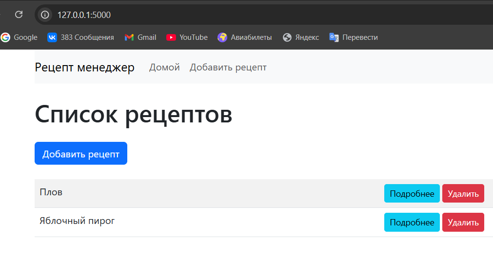
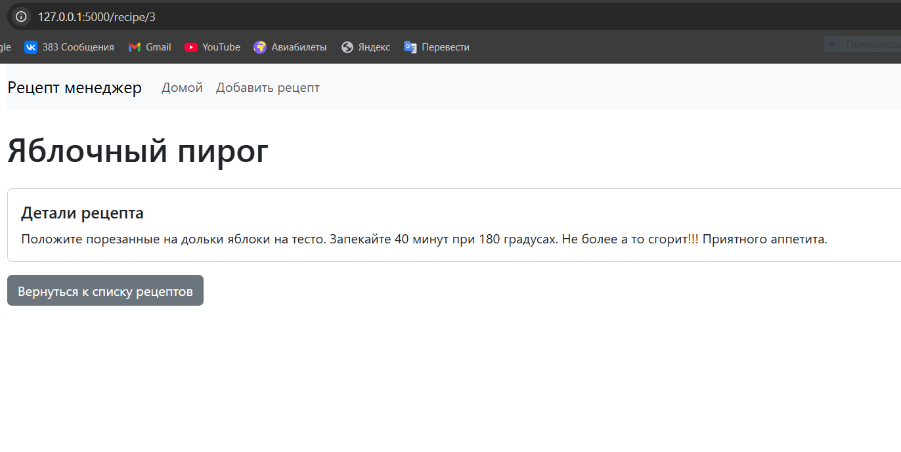
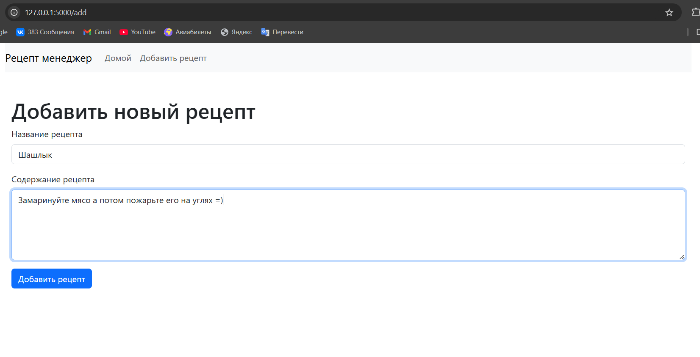
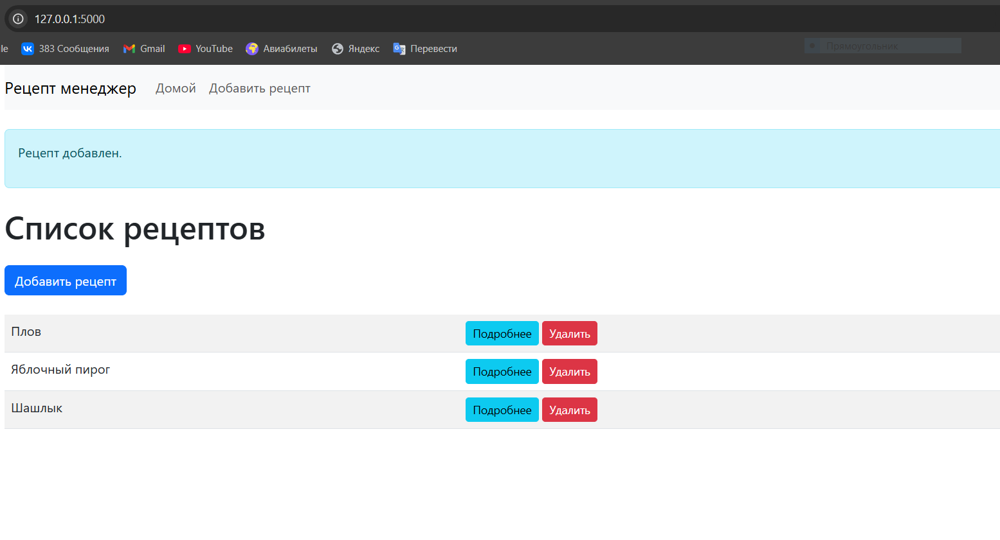

# Рецепты на Flask

Этот проект представляет собой веб-приложение для добавления, просмотра и удаления рецептов с использованием Flask, SQLAlchemy и PostgreSQL.

## Требования

Для запуска проекта необходимо установить следующие зависимости:

- Python 3.x
- PostgreSQL

